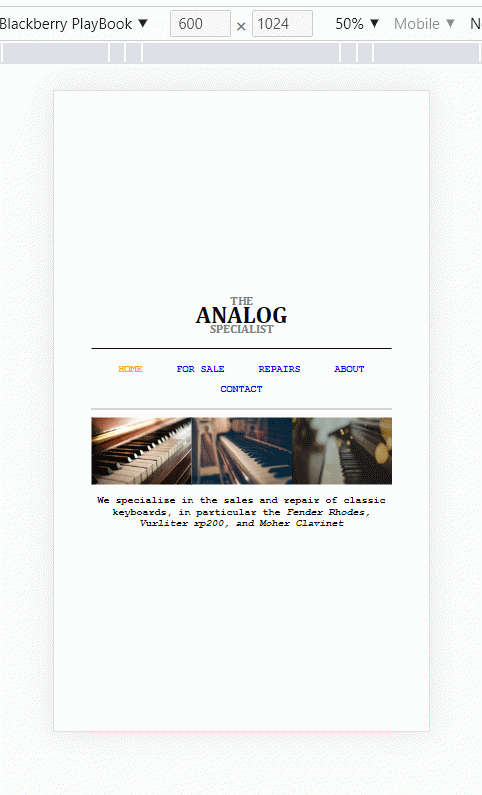
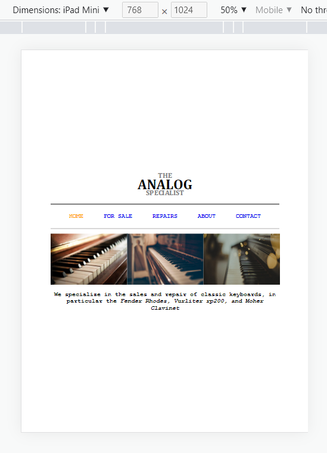
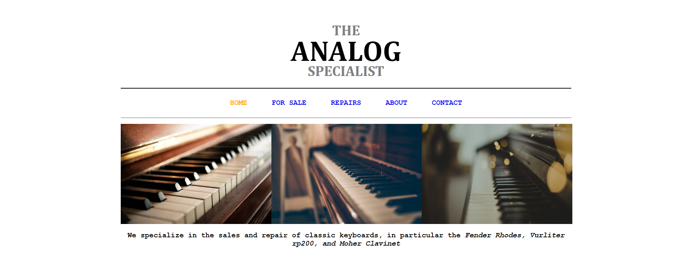

# CREATION OF LANDING PAGE 4

## A WEB DESIGN LANDING PAGE

## Welcome back!!!

##let's get started.

Thank you for checking this work.

## About This Work:

This work is created for the purpose of practising and revising (HTML & CSS) responsive web design with right and well measured web units for the purpose of ensuring effective layout and structure of website, and other HTML templates.

## pictures of this Work

##An Example##
##Collective collections##

##process##
THIS FILE IS FOR THE PRACTISE OF HTML(DEEPER)
-PRACTISE FOR THE BUILDING OF MODERN SEMANTIC WEBSITE
-STRUCTURES OF DIFFERENT ELEMENTS, MOSTLY BLOCK LEVEL ELEMENTS.
-PRACTISED THE USE OF IMAGES WITH THE RIGHT DESCRIPTION AND LAYOUT.
-PRACTISE MODERN STRUCTURING OF A WEB PAGE WITH LESS TAGS AND STRAIGHT FOWARD CODE.

THIS FILE IS FOR THE PRACTISE OF CSS

-PRACTISED IN DETAILS ALL THE ESSENTIAL CSS LAYOUTS TO ENSURE SMOOTH DEVELOPMENT OF PAGE.
-USED FLEXBOX TO CONTROL THE DISPLAY PATTERN TOO.
-USED THE FLOAT PROPERTY TO MOVE TEXT, BOXES AND FAST LINKS AROUND
-USED THE QUERY PROPERTIES(MEDIA) IN ENSURING SMOOTH LAYOUT WITH ALL CHECKPOINTS BEING MET.
-IT'S ALSO RESPONSVE......

##Larger screen sizes##

##smaller screen sizes##

## Built with

      -HTML(Hypertext Mark-up Language)
      -CSS(Cascading Styles Sheet)

## My Challanges and lessons

Learnt how to create well optimized pictures for the web, used my fontsizes well, used my pixels for nice elements that will remain permanent in size as the work goes on and used the float property to section images properly. HTML AND CSS was fun working with.

## Installations

-For those Farmiliar with Git-hub you can clone the repo and pull to your local workplace to view.

-For those who want to check the work from the site, click here [https://chukwuma5.github.io/piano/], to view Thank you once again.

-For those who want to view the file through drop box, click here [https://www.dropbox.com/sh/7kgx3rcauzh62cd/AACxoPMutSHvzrd7uSj0UMCJa?dl=0], to view Thank you once again.

-For those who want to view the file through git-hub, click here [https://github.com/chukwuma5/piano], to view Thank you once again.

## Best syntax Used

    ``CSS

(queries(media)), (flex-box), and (power of proper font usage).
Media queries is very important to practise building easy and responsive layout stuctures for all sections in the site also with the css float property to give accurate width to image boxes. You will see them all around modern websites and web apps.
``

## Resources that helped

-For the Colors[https://htmlcolorcodes.com/color-names/]

-For the icons[https://fontawesome.com/v5.15/icons/instagram?style=brands] and svg's in the folder.

-For the Fonts[https://fonts.google.com/]

-For the images, you can use 1.[https://unsplash.com/]

-For the images, you can use 2.[https://pixabay.com/]

-for the image editing, you can use[https://photoscape.org]

## Licsense

This work is under [MIT] liscence. It's highly free and opensource to anyone.
